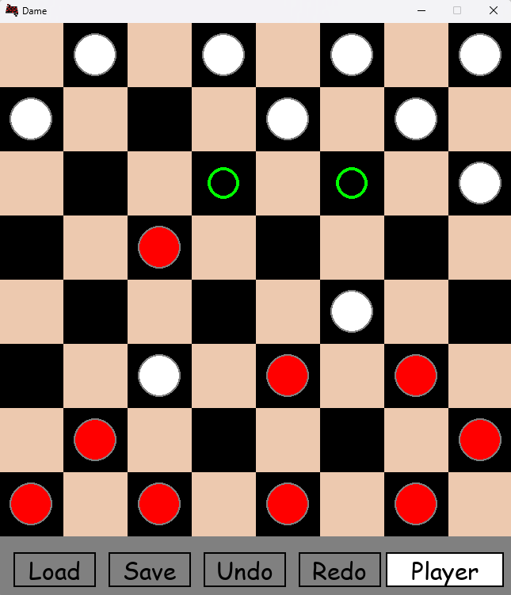

# 🧩 Checkers Game – OOP & Design Patterns Implementation

This project is a graphical checkers (Dame) game implemented using object-oriented design principles and key software design patterns. The codebase demonstrates modularity, separation of concerns, and extensibility through patterns such as **MVC**, **Memento**, **Command**, and **Strategy**.

---

## 🖼️ Screenshot

Here's a preview of the game's interface:



---

## 🧱 Design Patterns Used

### 🗂️ MVC (Model-View-Controller)

- **Model (`GameModel`)**:  
  Manages the game state and rules. Includes:
  - `GameBoard`: Maintains the state of the board and pieces.
  - `Piece`: Represents individual game pieces.

- **View (`GameView`)**:  
  Handles all UI and rendering logic.
  - Draws the board, pieces, and buttons.
  - Updates the display based on the model.

- **Controller (`GameController`)**:  
  Mediates between user input, model, and view.
  - Processes user commands.
  - Updates game state and triggers re-renders.

---

### 🧠 Memento Pattern

Used for implementing **Undo/Redo** and **Save/Load** functionalities:

- **Originator**: `GameBoard`  
- **Memento**: `GameBoardMemento`  
- **Caretaker**: `Caretaker` (manages undo/redo stack)

---

### ⚙️ Command Pattern

Encapsulates user actions as command objects, making the game more modular and extensible.

- Base: `GameCommand`
- Concrete Commands:
  - `MoveCommand`
  - `SaveCommand`
  - `LoadCommand`
  - `UndoCommand`
  - `RedoCommand`

---

### ♟️ Strategy Pattern

Allows dynamic selection of movement logic for different piece types.

- Implemented Strategies:
  - `NormalMoveStrategy`
  - `KingMoveStrategy`

---

## 🎮 Features

- Fully playable checkers game with graphical UI.
- Undo/Redo functionality for move history.
- Save and load game state.
- Clean modular architecture using OOP principles.
- Easily extendable to support additional rules or piece types.

---

## ✅ How to Run

> _Add your specific setup here if needed (e.g., Java with Gradle/IntelliJ, Python with Tkinter, etc.)_

Example (Java):
```bash
javac *.java
java Main

